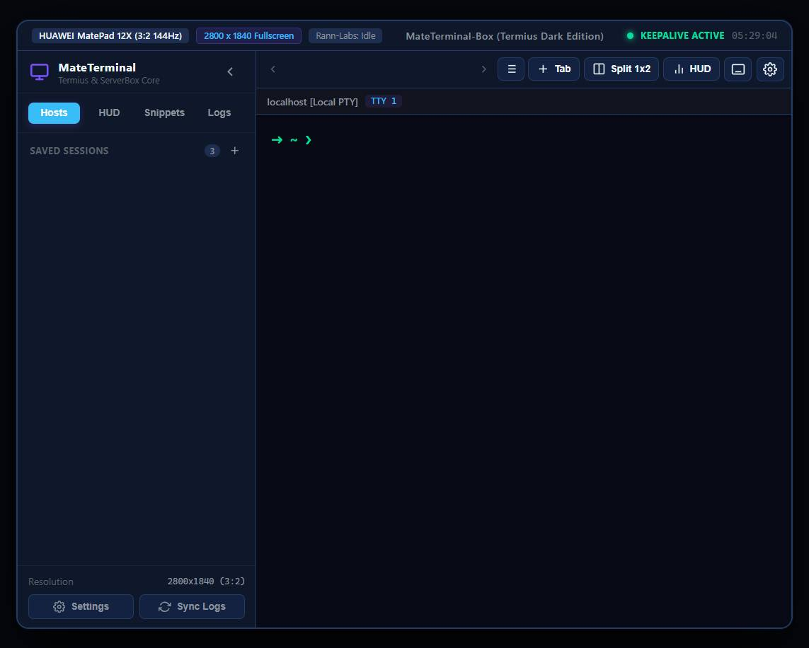
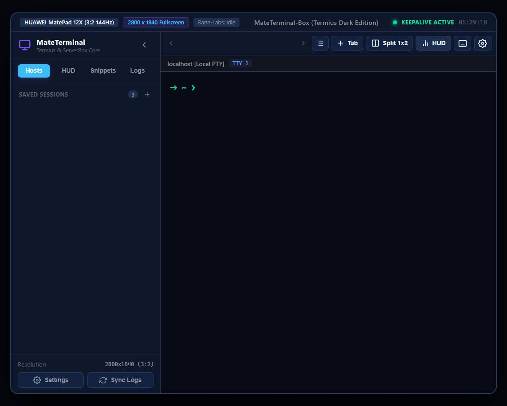
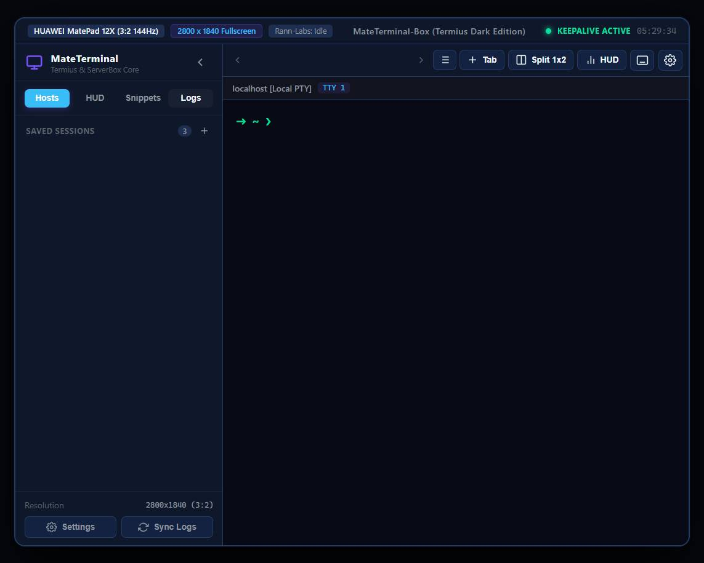
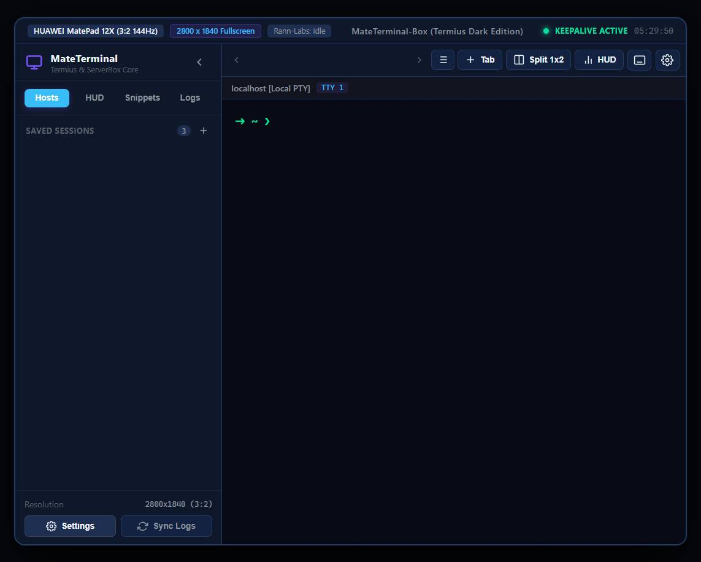

# MateTerminal-Box [MTB]
**Dedicated High-Performance Terminal Emulator, SSH Manager & ServerBox Telemetry HUD for Huawei MatePad 12X**

---

## Visual Showcase (Huawei MatePad 12X 3:2 Resolution)

| Termius Dark Main Terminal (v1.3.0) | Split 1x2 + ServerBox Telemetry HUD (v1.2.0) |
| :---: | :---: |
|  |  |

| Daily Activity Logs & Rann-Labs Sync (v1.1.0) | Full Settings & Workstation Configuration (v1.1.0) |
| :---: | :---: |
|  |  |

---

## Overview

**MateTerminal-Box** is an open-source Android terminal emulator engineered specifically to solve display, scaling, and aspect ratio issues on modern productivity tablets—with specialized first-class optimization for the **Huawei MatePad 12X** (12.0" IPS LCD, 2800x1840 resolution, 3:2 aspect ratio, 144Hz, HarmonyOS / EMUI).

It integrates the best core strengths of three industry-standard tools into a unified workstation:
1. **Termius**: Unlimited host profile management, session persistence, credential/identity storage, Termius Dark signature palette (`#0e111a`, `#7952ff`), sticky modifiers, and snippets.
2. **Termux**: High-performance local Android POSIX PTY shell (`/system/bin/sh`) executed through a native C++ JNI bridge (`forkpty` / `openpty`).
3. **ServerBox**: Real-time server telemetry HUD monitoring CPU, RAM, Disk I/O, Network traffic, Docker containers, and top processes with local and remote target switching.

---

## Releases & Downloads

| Version | Status | Highlights | Release Assets |
| :--- | :--- | :--- | :--- |
| **[v1.3.0](RELEASE_NOTES.md#v130---termius-dark-uiux-vt100-matrix-streaming--sticky-keys)** | **Latest** | Termius Dark signature palette, direct VT100 character matrix buffer, sticky `CTRL`/`ALT` modifier keys, zero emojis. | [APK (v1.3.0)](https://github.com/rannlabs/mate-terminal-box/releases/download/v1.3.0/mate-terminal-box-universal.apk) &bull; [Simulator .ZIP](https://github.com/rannlabs/mate-terminal-box/releases/download/v1.3.0/mate-terminal-box-web-simulator.zip) |
| **[v1.2.0](RELEASE_NOTES.md#v120---inline-multiline-terminal-input-tab-overflow--dual-hud-target-switcher)** | Stable | Inline multiline drafting (`Shift+Enter`), Tab overflow scroll & dropdown switcher, dual local/remote HUD. | [APK (v1.2.0)](https://github.com/rannlabs/mate-terminal-box/releases/download/v1.2.0/mate-terminal-box-universal.apk) &bull; [Simulator .ZIP](https://github.com/rannlabs/mate-terminal-box/releases/download/v1.2.0/mate-terminal-box-web-simulator.zip) |
| **[v1.1.0](RELEASE_NOTES.md#v110---app-settings-persistence-collapsible-sidebar--rann-labs-log-sync)** | Stable | App Settings modal, collapsible/fixed sidebar, daily activity SQLite logs, Rann-Labs sync REST API. | [APK (v1.1.0)](https://github.com/rannlabs/mate-terminal-box/releases/download/v1.1.0/mate-terminal-box-universal.apk) &bull; [Simulator .ZIP](https://github.com/rannlabs/mate-terminal-box/releases/download/v1.1.0/mate-terminal-box-web-simulator.zip) |
| **[v1.0.0](RELEASE_NOTES.md#v100---initial-architecture--matepad-12x-32-landscape-display-engine)** | Base | Initial architecture, MatePad 12X 3:2 landscape scaling, C++ native PTY, ServerBox collector, JSch SSH core. | [APK (v1.0.0)](https://github.com/rannlabs/mate-terminal-box/releases/download/v1.0.0/mate-terminal-box-universal.apk) &bull; [Simulator .ZIP](https://github.com/rannlabs/mate-terminal-box/releases/download/v1.0.0/mate-terminal-box-web-simulator.zip) |

---

## Key Features

### 1. MatePad 12X Native 3:2 Display Engine
- **Zero Pillarboxing & Cropping**: Eliminates the black borders and side-cropping common with standard smartphone terminal emulators on HarmonyOS tablets.
- **HarmonyOS App Multiplier Bypass**: Configured with explicit `android.max_aspect="3.0"`, `android:resizeableActivity="true"`, and Huawei `EasyGoClient` metadata.
- **Dynamic Window Insets Handling**: Adapts dynamically to system status bars, navigation bars, and multi-window / split-screen floating modes.

### 2. Dual Terminal Execution Core & Termius Styling
- **Remote SSH Engine**: Built on non-blocking SSH client architecture supporting RSA/ED25519 keys, password authentication, and custom port forwarding.
- **Local Native PTY Shell**: High-speed pseudo-terminal implementation in C++ (`openpty`, `fork`, `execvp`) with POSIX terminal capabilities.
- **Termius Dark Aesthetics**: Native ANSI 24-bit TrueColor rendering, Powerline/Agnoster prompt styling, and Termius Dark palette (`#0e111a`, `#7952ff`).

### 3. Modular ServerBox Telemetry & System HUD (Optional)
- **Toggleable & Optional**: HUD view can be turned on/off via quick toolbar toggle or through settings to provide a distraction-free terminal workstation.
- **Dual Monitoring Scope**: Switch seamlessly between local tablet telemetry (Kirin/Snapdragon, RAM, internal storage, Wi-Fi 6+) and remote Linux servers (vCPU, NVMe, network bandwidth, Docker).

### 4. Collapsible & Fixed Sidebar Navigation
- **Collapsible Toggle**: Smooth animated drawer toggle (`[<]` / `[>]`) expanding active workspace from 900px to full 1200px.
- **Pinned / Fixed Mode**: Configurable in Settings to lock the sidebar open for heavy multi-session switching.
- **Fast Segmented Switcher**: Instant switching between Hosts, ServerBox HUD, Snippets, and Daily Logs.

### 5. Daily Activity Logging & Rann-Labs Server Sync
- **Local Offline-First Partitioning**: Chronologically records session lifecycle events, command executions, SSH connections, and alerts partitioned by date (`YYYY-MM-DD`) in local SQLite storage.
- **Rann-Labs Central Synchronization**: REST API batch sync to `https://api.rann-labs.com/v1/logs/sync` with offline idempotency, Bearer authentication, and retry queue.
- **Integrated Audit Viewer**: Built-in date picker, live keyword search, sync status indicators, and one-click JSON export.

### 6. Tablet Multi-Pane & Tab Session Manager
- **Multi-Pane Layouts**: Switch instantly between single pane (1x1) and dual side-by-side terminal panes (1x2) on the 2800x1840 canvas.
- **Comprehensive Settings Dialog**: Real-time configuration of Themes (Termius Dark, Tokyo Night, Monokai Pro, Cyber Slate, Solarized Dark), font scaling (12px to 18px), Rann-Labs endpoint, auto-sync triggers, and log retention policies.
- **Sticky Accessory Bar**: Dedicated shortcuts for `ESC`, `TAB`, `CTRL` (sticky toggle), `ALT` (sticky toggle), `PIPE (|)`, `ARROW KEYS`, and customizable snippets.
- **Foreground Keepalive Service**: Persistent notification service with `WAKE_LOCK` to prevent OS sleep termination during long-running tasks.

---

## Repository Structure

```text
mate-terminal-box/
├── .github/workflows/
│   └── build-release.yml                  # Automated GitHub Actions CI/CD Pipeline
├── app/
│   ├── build.gradle                       # Android App Build Configuration
│   └── src/main/
│       ├── AndroidManifest.xml            # Fullscreen & Display Scaling Directives
│       ├── cpp/                           # Native C++ Pseudo-Terminal Bridge
│       │   ├── CMakeLists.txt
│       │   └── pty_bridge.cpp             # openpty, forkpty, ioctl JNI routines
│       ├── java/com/mateterminal/box/
│       │   ├── MateTerminalApplication.kt
│       │   ├── core/
│       │   │   ├── monitor/               # ServerBox Telemetry Collectors
│       │   │   ├── pty/                   # Local Native PTY Controller
│       │   │   ├── ssh/                   # SSH Client Manager & Credentials
│       │   │   ├── storage/               # SQLite Host, Log & Sync Models
│       │   │   └── theme/                 # Termius Dark & Oh-My-Zsh Themes
│       │   ├── service/                   # Foreground Keepalive Service
│       │   └── ui/                        # MainActivity & Tablet View Controllers
│       └── res/                           # Tablet Layouts, Vectors & Styles
├── docs/
│   └── screenshots/                       # High-Resolution UI/UX Screenshots
├── web/                                   # Interactive Tablet Web Simulator
│   ├── index.html                         # MatePad 12X 3:2 Canvas & HUD
│   ├── style.css                          # Termius Dark Design System
│   └── app.js                             # Virtual Terminal & Sticky Key Poller
├── RELEASE_NOTES.md                       # Comprehensive Version Release Notes
├── gradle/                                # Gradle Wrapper
├── build.gradle                           # Top-Level Build Configuration
└── settings.gradle                        # Project Modules
```

---

## Building & Release Packaging

### Android Build
```powershell
# Build Debug APK
./gradlew assembleDebug

# Build Release APK
./gradlew assembleRelease
```

### Web Simulator Preview
Launch the included standalone MatePad 12X web simulator by opening `web/index.html` in any modern web browser or preview server to experience the 3:2 layout, live telemetry animations, sticky modifier keys, and dual terminal pane workflows.
